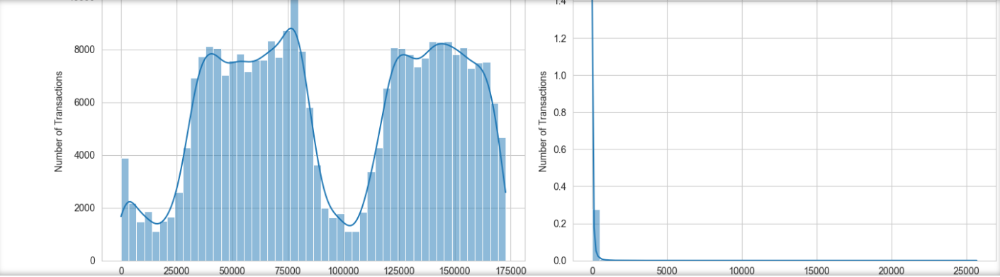

-----

# Credit Card Fraud Detection System

-----

## Project Overview

This project implements a machine learning-based system to detect fraudulent credit card transactions. Given the highly imbalanced nature of real-world fraud datasets, a key focus of this project is on effectively handling class imbalance to build robust and reliable models, prioritizing the detection of actual fraudulent activities.

-----

## Problem Statement

Credit card fraud is a significant concern for financial institutions and customers alike, leading to substantial financial losses. Detecting fraudulent transactions in real-time is challenging due to several factors:

  * **Extreme Class Imbalance:** Fraudulent transactions are extremely rare compared to legitimate ones (typically less than 0.2% of all transactions). This imbalance makes standard classification models ineffective as they might simply predict the majority class and still achieve high accuracy, while completely missing the minority (fraudulent) class.
  * **Data Anonymization:** For privacy reasons, features are often anonymized (e.g., PCA transformed), making direct interpretation difficult.
  * **Need for High Recall:** In fraud detection, it's typically more critical to minimize **False Negatives** (actual fraud missed by the system) than to minimize False Positives (legitimate transactions incorrectly flagged as fraud). Missing an actual fraud costs money, while a false alarm might just inconvenience a customer with a transaction review.

This project aims to build a model that effectively addresses the class imbalance to achieve a high **Recall** score while maintaining reasonable **Precision**.

-----

## Dataset

The dataset used in this project is the "Credit Card Fraud Detection" dataset, publicly available on Kaggle.

  * **Source:** [https://www.kaggle.com/datasets/mlg-ulb/creditcardfraud](https://www.kaggle.com/datasets/mlg-ulb/creditcardfraud)
  * **Contents:** It contains anonymized transaction data from European cardholders over two days.
      * `Time`: Seconds elapsed between each transaction and the first transaction in the dataset.
      * `V1` - `V28`: PCA transformed features, representing the principal components obtained from the original highly dimensional features.
      * `Amount`: Transaction amount.
      * `Class`: The target variable, where `0` represents a normal transaction and `1` represents a fraudulent transaction.

**Dataset Characteristics:**

  * Total transactions: 284,807
  * Normal transactions (`Class = 0`): 284,315 (99.827%)
  * Fraudulent transactions (`Class = 1`): 492 (0.173%)

-----

## Methodology

The project follows a standard machine learning pipeline:

### 1\. Data Loading & Exploratory Data Analysis (EDA)

  * The `creditcard.csv` file is loaded into a Pandas DataFrame.
  * Initial inspection (`df.head()`, `df.info()`, `df.describe()`) is performed to understand data types, missing values, and statistical distributions.
  * **Crucial Step:** The severe class imbalance is visually confirmed and quantified using `value_counts()` and `countplot`.
  * Distributions of `Time` and `Amount` features are visualized.


### 2\. Data Preprocessing

  * **Feature Scaling:** `Time` and `Amount` columns (which are not PCA-transformed) are scaled using `StandardScaler` to ensure they do not disproportionately influence the models. PCA features (V1-V28) are already scaled.
  * **Data Splitting:** The dataset is split into training (80%) and testing (20%) sets. `stratify=y` is used during `train_test_split` to maintain the original class proportion in both sets, which is vital for imbalanced data.

### 3\. Handling Imbalanced Data

  * Given the extreme class imbalance, traditional models would perform poorly on the minority class.
  * **SMOTE (Synthetic Minority Over-sampling Technique)** is applied to the **training data only**. SMOTE works by creating synthetic samples of the minority class (fraudulent transactions) based on the existing minority samples. This helps to balance the class distribution in the training set, allowing models to learn the patterns of fraudulent transactions more effectively.

### 4\. Machine Learning Models

Three different classification algorithms are trained and evaluated:

  * **Logistic Regression:** A linear model often used as a baseline for classification tasks.
  * **Decision Tree Classifier:** A non-linear model that learns decision rules from features.
  * **Random Forest Classifier:** An ensemble learning method that builds multiple decision trees and combines their predictions to improve accuracy and reduce overfitting.

All models are initialized with `class_weight='balanced'` (in addition to SMOTE) to further emphasize the minority class during training.

### 5\. Model Evaluation

Due to the class imbalance, standard `accuracy` is not a reliable metric. The following metrics are prioritized:

  * **Confusion Matrix:** Provides a detailed breakdown of True Positives (TP), True Negatives (TN), False Positives (FP), and False Negatives (FN).
      * **True Positives (TP):** Correctly predicted fraud.
      * **False Negatives (FN):** Actual fraud instances missed by the model (most critical to minimize).
      * **False Positives (FP):** Normal transactions incorrectly flagged as fraud.
      * **True Negatives (TN):** Correctly predicted normal.
  * **Precision:** $TP / (TP + FP)$ - Out of all predicted positives, how many were actually positive?
  * **Recall (Sensitivity):** $TP / (TP + FN)$ - Out of all actual positives, how many were correctly identified? **This is the primary metric for fraud detection.**
  * **F1-Score:** $2 \* (\\text{Precision} \* \\text{Recall}) / (\\text{Precision} + \\text{Recall})$ - The harmonic mean of Precision and Recall, providing a single metric that balances both.
  * **ROC-AUC (Receiver Operating Characteristic - Area Under Curve):** Measures the model's ability to distinguish between classes. Higher values indicate better performance.
  * **Precision-Recall Curve:** Visualizes the trade-off between precision and recall for different threshold settings.

-----

## Key Findings & Results

After training and evaluating the models on the *unresampled* test set, here are the key results for Logistic Regression (you'll add others after running your notebook):

**Logistic Regression Results:**

  * **Accuracy:** \~0.9742
  * **Precision:** \~0.0580
  * **Recall:** **\~0.9184 (Excellent)**
  * **F1-Score:** \~0.1092
  * **ROC-AUC Score:** \~0.9699

**Confusion Matrix for Logistic Regression:**

```
[[55403  1461]
 [    8    90]]
```


**Interpretation:**
The Logistic Regression model achieved a very high **Recall of over 91%**, meaning it successfully identified the vast majority of actual fraudulent transactions (90 out of 98 in the test set). This is crucial for a fraud detection system. However, this came at the cost of lower precision (around 5.8%), leading to a significant number of false positives (1461 normal transactions incorrectly flagged as fraud). This highlights the common trade-off in imbalanced classification: increasing recall often leads to a decrease in precision.

*(Repeat similar sections for Decision Tree and Random Forest once you have their results, e.g., "Decision Tree Results" and "Random Forest Results" with their respective metrics and confusion matrices.)*

**Overall Comparison:**
*(Once you have all results, you can add a small summary comparing the models, e.g., "While Logistic Regression showed strong recall, Random Forest often provides a better balance between precision and recall for this dataset, making it a potentially more robust choice for real-world deployment where minimizing false positives is also important.")*

-----

## How to Run Locally

To run this project on your local machine, follow these steps:

1.  **Clone the Repository:**

    ```bash
    git clone https://github.com/KeerthiLBangera/credit_card_fraud_detection.git
    cd credit_card_fraud_detection
    ```

    (If you manually uploaded, just download the zip file and extract it.)

2.  **Download the Dataset:**

      * Go to the [Kaggle Credit Card Fraud Detection dataset page](https://www.kaggle.com/datasets/mlg-ulb/creditcardfraud).
      * Download the `creditcard.csv` file.
      * Place `creditcard.csv` directly into your `credit_card_fraud_detection` project directory.

3.  **Create a Virtual Environment (Recommended):**

    ```bash
    python -m venv venv
    # On Windows:
    .\venv\Scripts\activate
    # On macOS/Linux:
    source venv/bin/activate
    ```

4.  **Install Dependencies:**

    ```bash
    pip install -r requirements.txt
    ```


5.  **Launch Jupyter Notebook:**

    ```bash
    jupyter notebook
    ```

6.  **Run the Notebook:**

      * Your web browser will open with the Jupyter dashboard.
      * Click on `credit_card.ipynb` .
      * Run each cell sequentially by selecting the cell and pressing `Shift + Enter`.

-----

## Future Enhancements

  * **Hyperparameter Tuning:** Use `GridSearchCV` or `RandomizedSearchCV` to optimize model hyperparameters for better performance.
  * **Cross-Validation:** Implement k-fold cross-validation for a more robust evaluation of model performance.
  * **Anomaly Detection Algorithms:** Explore models specifically designed for anomaly detection (e.g., Isolation Forest, One-Class SVM).
  * **Advanced Feature Engineering:** Create new features from `Time` (e.g., hour of day, day of week) or by aggregating `Amount` for specific entities.
  * **Deployment:** Explore how such a model could be deployed in a real-time environment (e.g., using Flask/FastAPI, Docker).
  * **Monitoring:** Consider strategies for monitoring model performance drift in production.

-----
## Outputs and Visualizations

This section showcases the key visualizations and outputs generated during the project's execution.

### Exploratory Data Analysis (EDA) Plots

#### 1. Transaction Time Distribution

This histogram shows the distribution of transaction times.


*(Replace this line with the actual markdown for your Time Distribution plot screenshot)*


### Model Evaluation Visualizations

#### 1. Logistic Regression Confusion Matrix

This matrix shows the performance of the Logistic Regression model on the test set, detailing True Positives, False Positives, True Negatives, and False Negatives.


*(Replace this line with the actual markdown for your Logistic Regression Confusion Matrix plot screenshot)*

#### 2. Decision Tree Confusion Matrix

The confusion matrix for the Decision Tree Classifier.


*(Replace this line with the actual markdown for your Decision Tree Confusion Matrix plot screenshot)*

#### 3. Random Forest Confusion Matrix

The confusion matrix for the Random Forest Classifier.


*(Replace this line with the actual markdown for your Random Forest Confusion Matrix plot screenshot)*

---


